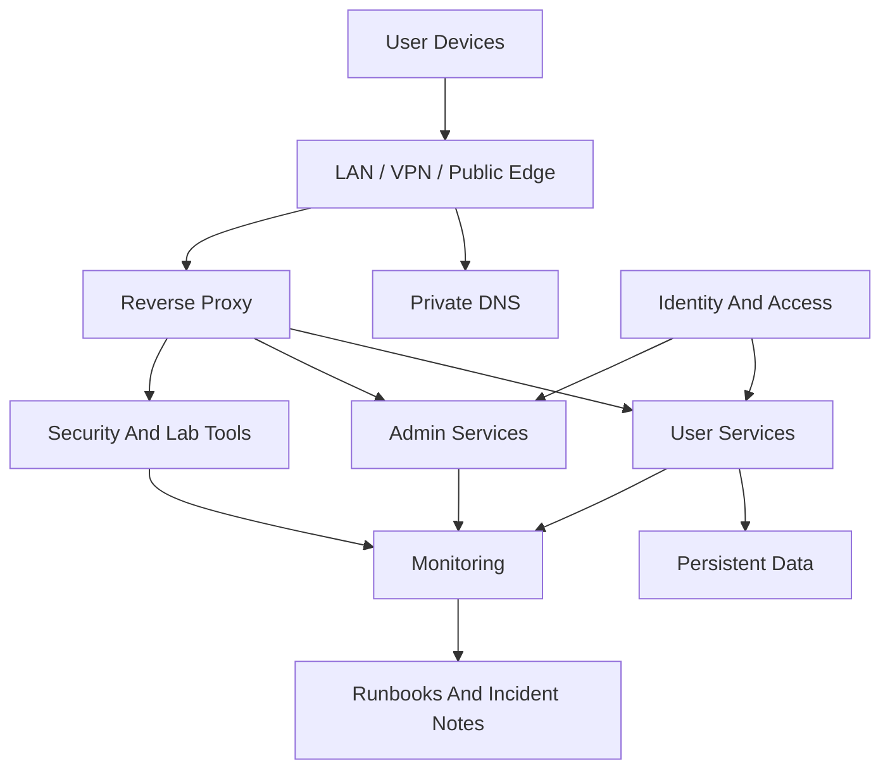

# Tempest Lab Systems

Tempest Lab Systems is a fully documented enterprise-style reference architecture for modern self-hosted infrastructure.

It is built as an operational environment: private by default, monitored, recoverable, security-aware, and documented with enough detail to explain both design intent and failure response.

## Repository Status

Status: Active flagship project

Primary focus:

- Infrastructure architecture.
- Service operations.
- Identity and access planning.
- Public/private service exposure.
- Monitoring and alert design.
- Security posture review.
- Automation and recovery workflows.
- Platform service case studies.

## What It Demonstrates

Tempest shows practical engineering judgment across the full lifecycle of systems people actually rely on:

- Containerized service hosting with documented recovery paths.
- Private DNS and HTTPS routing for clean internal service access.
- Reverse proxy patterns for private services and selected public-facing apps.
- Identity and onboarding planning with MFA, groups, and break-glass access.
- Monitoring that separates public-path failures from private-origin failures.
- Media and file workflows that account for real users, messy uploads, and metadata edge cases.
- Remote access and support workflows for devices outside the LAN.
- Security review, remediation tracking, and contained cyber range planning.
- Practical platform services that expose real operations, access, monitoring, and recovery problems.

The point is not to show a perfect environment. The point is to show practical engineering judgment: build, test, break, recover, document, and improve.

## Start Here

| Area | Read This | Why It Matters |
| --- | --- | --- |
| Platform | [Architecture overview](docs/architecture/overview.md) | High-level topology, major layers, and design principles. |
| Services | [Service catalog model](docs/architecture/service-catalog.md) | How services are classified, exposed, monitored, and documented. |
| Security | [Security posture review](docs/security/security-posture-review.md) | Practical hardening model for the platform. |
| Media | [Home media platform case study](docs/projects/home-media-platform.md) | Streaming, remote access, library automation, and metadata cleanup. |
| Media Ingest | [Veldora to Shuna ingest workflow](docs/guides/nextcloud-drop-folder-to-media-library.md) | Reproducible Nextcloud-to-Jellyfin staging, ingest, scan, and recovery pattern. |
| Public Media Edge | [Shuna public edge and reverse proxy](docs/guides/shuna-public-edge-reverse-proxy.md) | No-domain testing, owned-domain setup, safe reverse proxying, validation, and rollback. |
| Operations | [Runbook index](docs/operations/runbook-index.md) | Recovery notes and checklists written from real issues. |
| Roadmap | [Tempest roadmap](ROADMAP.md) | Current direction and future platform improvements. |

## Platform Shape

## Featured Work

### Public And Private Service Edge

The platform separates services into private-only, VPN-reachable, and carefully selected public-facing categories. The public edge material covers the design decisions behind exposing user services without treating every admin surface like it belongs on the internet.

[Read the public/private edge guide](docs/guides/public-private-service-edge.md)

### Media Ingest Automation

The media platform grew from basic streaming into a real operations story: Veldora drop folders, Shuna libraries, access paths, TV apps, remote users, library imports, metadata cleanup, disk pressure, and monitors that explain where a failure lives.

[Read the media platform case study](docs/projects/home-media-platform.md)

[Read the Veldora to Shuna ingest workflow](docs/guides/nextcloud-drop-folder-to-media-library.md)

[Read the Shuna public edge guide](docs/guides/shuna-public-edge-reverse-proxy.md)

### Monitoring That Helps

The monitoring notes focus on actionable signals: whether the service is down, the proxy path is broken, DNS is wrong, or the alert itself is noisy.

[Read the monitoring guide](docs/guides/monitoring-that-helps.md)

## Documentation Map

- [Architecture](docs/architecture/overview.md)
- [Service catalog](docs/architecture/service-catalog.md)
- [Guides](docs/guides/README.md)
- [Platform service case studies](docs/projects/README.md)
- [Operations runbooks](docs/operations/runbook-index.md)
- [Incident notes](docs/incident-notes/README.md)
- [Security review](docs/security/security-posture-review.md)
- [Roadmap](ROADMAP.md)
- [Veldora to Shuna ingest diagram](diagrams/veldora-to-shuna-ingest.mmd)
- [Shuna public edge diagram](diagrams/shuna-public-edge.mmd)

## Operating Principles

Tempest exists because practical infrastructure surfaces the problems polished tutorials often skip:

- Services work on LAN but fail offsite.
- DNS behaves differently across phones, desktops, VPN clients, and public users.
- Containers survive while their host integrations change underneath them.
- Security fixes improve posture but sometimes break usability.
- Users need onboarding, support, and offboarding, even in a small environment.
- Documentation only matters if it helps during the failure, not after the story is already over.

The platform captures those lessons while they are still fresh.

## Portfolio Context

Tempest is the flagship AngryAtom project. It anchors the broader portfolio by showing how infrastructure, automation, security, monitoring, platform services, and documentation fit together as one maintainable engineering system.
