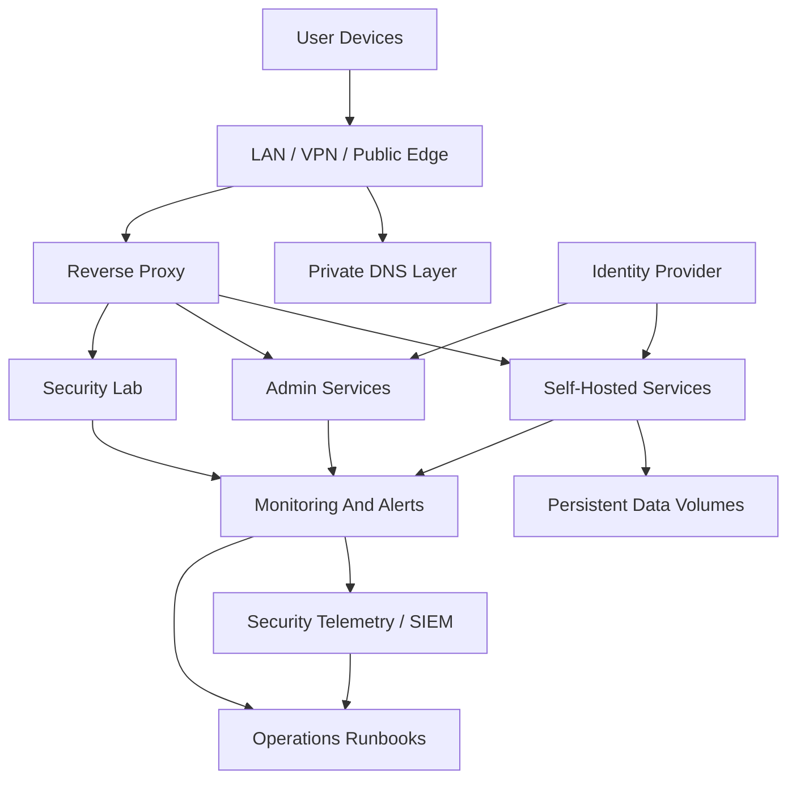

# Architecture Overview

Tempest Lab Systems is organized around one core idea: make self-hosted infrastructure behave like a small, professional platform.

The environment combines container hosting, internal DNS, reverse proxy routing, monitoring, identity, media services, remote access, and security experimentation.

## Reference Topology

## Major Layers

| Layer | Purpose | Example Tools |
| --- | --- | --- |
| Network access | LAN, VPN, and selected public routes | Tailscale-style VPN, firewall rules |
| DNS | Human-friendly service names | AdGuard-style private DNS |
| Reverse proxy | HTTPS, routing, public/private edges | Caddy-style proxy |
| Container runtime | Service deployment and isolation | Docker, Docker Compose, Portainer-style UI |
| Identity | Users, groups, onboarding, SSO planning | Authentik-style identity provider |
| Monitoring | Availability and useful failure signals | Uptime Kuma-style monitors |
| Security telemetry | Host, container, reverse-proxy, honeypot, and custom event collection | Wazuh-style SIEM |
| Media | Personal streaming and ingest workflows | Jellyfin-style media server |
| Storage | Cloud sync and temporary drop folders | Nextcloud-style file sync |
| Security lab | Defensive and offensive practice in a contained environment | Honeypots, telemetry, cyber range tools |

## Design Principles

- Private-by-default for administrative services.
- Public exposure only for selected services with their own authentication and monitoring.
- One service catalog that documents hostname, purpose, owner, access path, monitoring, and recovery notes.
- Runbooks for failure cases, not just happy-path deployment.
- Clear separation between operational notes, user-facing docs, and engineering writeups.

## Example Named Services

Tempest uses sanitized public names for selected lab systems:

| Name | Public Role Description |
| --- | --- |
| Veldora | Nextcloud-style file-sync and media upload staging service. |
| Shuna | Jellyfin-style media streaming and library service. |
| Ciel | Automation, coordination, or assistant-style lab service where safe to document. |
| Ranga | Approved lab service or support component. |
| Benimaru | Approved lab service or support component. |
| Soei | Approved lab service or support component. |
| Dedicated SOC Node | Private SIEM and security telemetry platform. |

Only public-safe service roles and sanitized configuration patterns belong in this repository.

## Related Architecture Notes

- [Telemetry and SIEM architecture](telemetry-and-siem-architecture.md)
