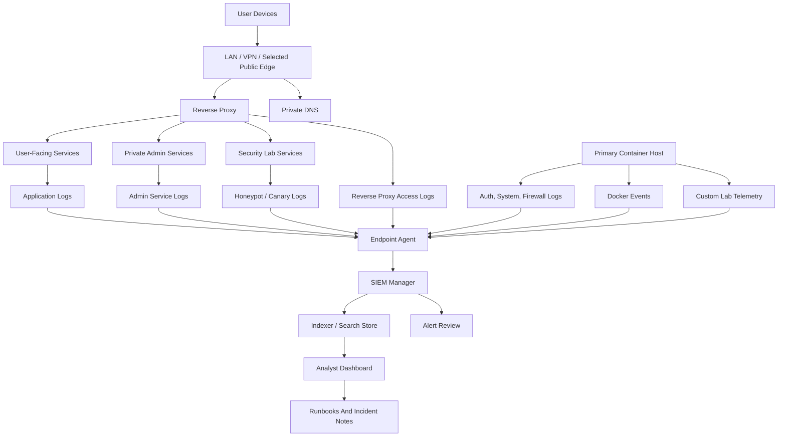

# Telemetry And SIEM Architecture

This document describes the public-safe architecture for the Tempest security telemetry layer.

It is based on a real homelab deployment, but hostnames, IP ranges, account names, secrets, and provider-specific details are intentionally omitted. The goal is to show the engineering pattern: how a small self-hosted platform can grow from basic uptime checks into a useful defensive monitoring stack.

## Architecture Goals

The SIEM layer was designed around five practical goals:

| Goal | Why It Matters |
| --- | --- |
| Keep security tooling private | Admin and SIEM surfaces should not become public targets. |
| Separate user services from analysis workload | Indexing and search can be heavier than normal homelab apps. |
| Collect from the host, not just containers | Auth logs, service logs, firewall state, and Docker activity all matter. |
| Prove data flow before tuning rules | A dashboard without useful events is not a SOC. |
| Document failure modes while they are fresh | Runbooks are most valuable when they capture real recovery work. |

## High-Level Topology

## Trust Boundaries

The most important design choice is that the SIEM is private infrastructure.

| Boundary | Public-Safe Pattern |
| --- | --- |
| Public internet | Only selected user services are exposed. SIEM, identity admin, container admin, DNS admin, and password vault stay private. |
| LAN/VPN | Administrative access lives here, with MFA and least privilege where supported. |
| Container networks | Application-to-application routes stay narrow and documented. |
| Host logs | Collected by an agent with carefully scoped access. |
| SIEM dashboard | Available only through private access paths. |

This keeps the defensive layer from increasing the public attack surface.

## Data Sources

The first production-useful SIEM milestone was not "all possible logs." It was a focused set of signals from the primary lab host.

| Source | Example Signal | Operational Use |
| --- | --- | --- |
| Authentication logs | SSH login attempts, sudo use, session open/close | Spot brute-force attempts, unusual admin access, privilege changes. |
| System logs | Service failures, kernel messages, restart loops | Explain service instability and power-loss recovery behavior. |
| Reverse proxy logs | Status codes, user agents, request paths, upstream failures | Separate public-edge problems from origin-service problems. |
| Docker events | Container start/stop/recreate/health activity | See deployment actions and unexpected container churn. |
| Honeypot/canary logs | Fake SSH, HTTP, Telnet, or database probes | Detect low-effort probing and lab traffic experiments. |
| Custom telemetry | App-specific health and workflow events | Bring earlier dashboards and scripts into the same investigation path. |

## SIEM Node Components

The dedicated SOC node runs the security stack separately from normal user services.

| Component | Role |
| --- | --- |
| Manager | Receives agent events, applies rules, and provides the API. |
| Indexer | Stores searchable security events. |
| Dashboard | Provides analyst views, API status, agent inventory, and event search. |
| Agent enrollment | Connects hosts to the manager with explicit trust. |
| Monitoring checks | Separately validate dashboard, API, and listener health. |

Keeping these components on a separate host makes performance and storage easier to reason about.

## Access Model

Identity is treated as a platform concern, even where individual tools still keep local users.

| Access Layer | Pattern |
| --- | --- |
| Human admin access | Private network path, strong unique credentials, MFA where supported. |
| SIEM dashboard | Private-only admin surface. |
| Agent enrollment | Controlled manually, documented, and validated after enrollment. |
| Break-glass access | Kept separate from normal daily accounts. |
| Credential storage | Password manager, not runbooks or public docs. |

The identity provider is used as the central planning layer for users, groups, lifecycle notes, and future SSO integration. The public documentation does not claim SSO coverage for a tool until that login flow has been tested.

## Event Flow

The practical event pipeline looks like this:

1. A service, host, proxy, container runtime, or lab tool emits an event.
2. The endpoint agent tails the configured source or listens for supported event streams.
3. The agent forwards events to the SIEM manager over the private network.
4. The manager normalizes and evaluates events.
5. The indexer stores searchable records.
6. The dashboard provides triage, search, and agent status.
7. Serious findings become alerts, runbook updates, or incident notes.

The key validation step is proving that each source creates searchable events, not just proving that the dashboard loads.

## Deployment Decisions

| Decision | Rationale |
| --- | --- |
| Dedicated SIEM host | Prevents search/index workload from competing with media, file sync, and password management. |
| Private DNS name | Gives a readable access path without public exposure. |
| Separate storage volume | Makes index growth easier to monitor and eventually migrate. |
| Agent-first rollout | Starts with the highest-value host before adding every device. |
| Internal monitors | Detect whether the dashboard, API, and agent listener are healthy. |
| Runbook-driven changes | Every failure or fix becomes operational knowledge. |

## Useful Validation Checks

A freshly deployed SIEM should pass these checks before it is considered useful:

| Check | Expected Result |
| --- | --- |
| Dashboard login | Dashboard loads and requires authentication. |
| Manager API | API is reachable from the dashboard service and direct admin path. |
| Indexer health | Search backend is green or otherwise healthy. |
| Agent status | Enrolled host appears active. |
| Log collectors | Intended files are listed as being monitored. |
| Docker event listener | Container events are visible after a harmless container action. |
| Reverse proxy event | A harmless web request appears in search. |
| Auth event | A known login/sudo test can be found. |
| Canary event | A controlled probe produces a searchable alert. |
| Monitoring | Dashboard, API, and listener checks report separately. |

## Real Implementation Lessons

### Dashboard Up Does Not Mean SIEM Ready

The dashboard can load while the backend API is misconfigured. A useful validation path checks the dashboard, manager API, indexer, agent status, and actual event search independently.

### Telemetry Can Capture Secrets

Container command arguments, healthchecks, scripts, and service monitors can be logged. If a secret appears in a command line, assume it can end up in telemetry.

The safer pattern is to pass secrets through environment files, secret stores, or tooling that does not expose them in process arguments or Docker event payloads.

### Power Recovery Needs A Checklist

After power loss, the questions are:

- Did the host come back?
- Did the container runtime come back?
- Did the SIEM stack come back?
- Are agents reconnecting?
- Are events still flowing?
- Are alert channels working?
- Did storage stay healthy?

That checklist belongs in the private runbook.

### Start With One Good Agent

One fully validated host is more valuable than ten hosts that only sort of report in. The first host should prove authentication logs, system logs, proxy logs, Docker events, and a test alert before scaling collection.

## Future Expansion

The next useful expansion areas are:

- Endpoint coverage for additional lab nodes.
- Windows workstation event collection.
- Firewall/router log ingestion where supported.
- Triage dashboards for auth, proxy, Docker, and honeypot events.
- Alert routing into the internal notification system.
- Incident note templates with evidence, timeline, impact, and corrective action.
- A DFIR-focused companion tool for deeper endpoint investigation.

The end state is not just "more logs." The end state is an investigation workflow that tells an operator what happened, where it happened, how confident the signal is, and what to check next.
