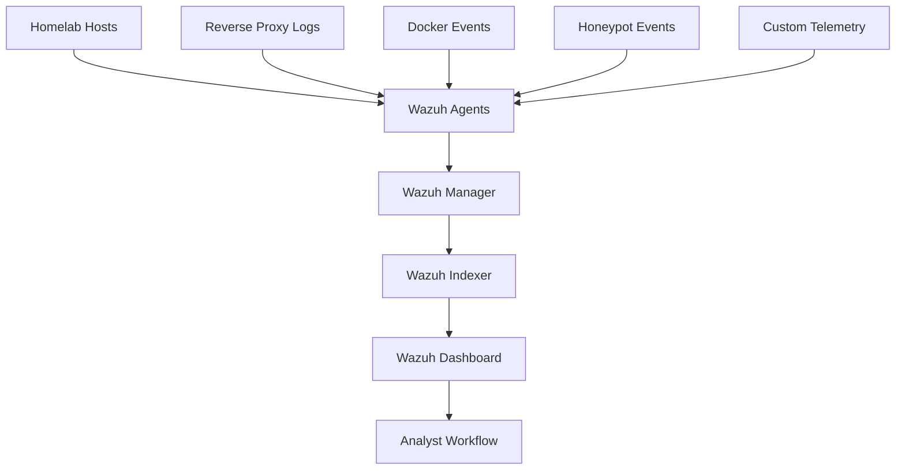

# Building A Homelab SIEM With Wazuh

This note captures the public version of a real Tempest Lab Systems milestone: turning a dedicated spare workstation into a working SOC/SIEM node and wiring the primary homelab host into it.

The goal was not just to install a dashboard. The goal was to make the lab observable: host events, container activity, reverse-proxy access, honeypot events, and earlier telemetry experiments all flowing into one defensive layer.

## What Was Built

The SIEM node runs Wazuh as a private-only security platform.

High-level shape:



Core pieces:

| Layer | Role |
| --- | --- |
| Dedicated SOC node | Runs the Wazuh manager, indexer, and dashboard |
| Primary lab host agent | Ships host, auth, service, Docker, proxy, and lab telemetry |
| Private DNS | Gives the SIEM a readable internal name |
| Monitoring | Watches dashboard/API/listener health separately |
| Password manager | Stores generated administrative credentials outside documentation |
| Runbooks | Capture install, validation, recovery, and gotchas |

## Why A Dedicated Node

Wazuh can be resource-hungry compared with small self-hosted apps. Moving it to a dedicated machine had a few practical wins:

- Keeps indexing and alerting load away from user-facing services.
- Makes storage growth easier to reason about.
- Gives the SOC layer its own maintenance window.
- Provides a cleaner migration path toward future DFIR tooling.
- Lets the original host remain focused on applications, media, and file services.

The dedicated box does not need to be exotic. A small-form-factor workstation with a modern enough CPU, 32GB RAM, and SSD storage is a solid starting point for a serious homelab SIEM.

## Private-Only Exposure

The SIEM dashboard and Wazuh ports were kept off the public internet.

The intended access model:

- Dashboard available only on LAN/VPN.
- Wazuh agent listener exposed only to trusted lab networks.
- Indexer API bound locally.
- Public domain and Cloudflare routes avoided for the SIEM.
- Monitoring checks remain internal.

This keeps the tool that watches the lab from becoming one more public admin surface to defend.

## First Agent Sources

The first enrolled host sends a useful starter set of telemetry:

| Source | Why It Matters |
| --- | --- |
| Auth logs | SSH, sudo, login, and privilege-use visibility |
| System logs | Service and host behavior |
| Reverse-proxy access logs | Web requests, status codes, user agents, and routing symptoms |
| Docker listener | Container lifecycle and runtime events |
| Honeypot logs | Intentional deception events from lab probes |
| Custom telemetry | Earlier lab-specific signals and staged detections |

The first success criterion was simple: the agent should appear active, log collectors should report the intended files, Docker events should show up, and test events should be searchable.

## A Real Gotcha: Dashboard API Credentials

One issue looked like “Wazuh is up, but the dashboard is not doing anything.”

The containers were healthy, the API port was reachable, and direct API authentication worked. The dashboard still showed the API connection offline.

The cause: generated credentials had been rotated into the real stack, but the dashboard-side Wazuh API configuration still had stale credentials.

The fix pattern:

1. Verify the Wazuh manager API works directly.
2. Verify internal container DNS can resolve the manager service.
3. Check dashboard logs for API auth failures.
4. Update the dashboard Wazuh API config from the current generated credential source.
5. Restart only the dashboard container.
6. Confirm dashboard API checks return successful responses.

That is a useful troubleshooting shape for any self-hosted dashboard that talks to a backend API: prove the backend, prove the network, then prove the service-to-service credential.

## A Better Gotcha: SIEMs Remember Secrets

Enabling Docker telemetry immediately exposed a bad pattern in one container healthcheck.

The healthcheck put a Redis password directly into command arguments. Docker events recorded that command, and the SIEM faithfully indexed it.

That was a great reminder:

> If a secret appears in a command line, assume telemetry can capture it.

Safer pattern:

```yaml
healthcheck:
  test: ["CMD-SHELL", "REDISCLI_AUTH=\"$${REDIS_HOST_PASSWORD}\" redis-cli ping"]
```

Less safe pattern:

```yaml
healthcheck:
  test: ["CMD", "redis-cli", "-a", "${REDIS_HOST_PASSWORD}", "ping"]
```

The fix was to move the secret out of the visible command arguments, recreate only the affected container, confirm it returned healthy, and remove the old sensitive records from the alert index.

That lesson is bigger than Redis. It applies to healthchecks, `docker exec`, wrapper scripts, CI logs, service monitors, and any automation that might be observed by a log collector.

## Validation Checklist

Useful post-install checks:

- Wazuh containers are running.
- Dashboard redirects unauthenticated users to login.
- Indexer health is green.
- Manager API authentication succeeds.
- Agent summary shows the expected active host.
- Agent local logs show each intended file being analyzed.
- Docker listener reports it started.
- A harmless test event becomes searchable.
- Monitoring checks distinguish dashboard, API, and listener health.

## Operational Lessons

- A SIEM that only has its own dashboard logs is not useful yet.
- The first agent matters more than the first pretty chart.
- Separate “service is running” from “data is flowing.”
- Keep the SIEM private by default.
- Treat container command arguments as telemetry-visible.
- Write runbooks while the failure is fresh.
- Build small, prove each signal, then widen collection.

## What Comes Next

The next phase is to turn collected events into analyst workflow:

- Triage views for authentication events.
- Container restart and healthcheck dashboards.
- Honeypot/canary hit review.
- Reverse-proxy suspicious request views.
- Alert routing for high-severity events.
- A repeatable incident note template.
- Eventually, a second DFIR tool alongside Wazuh.

The important part is that the lab now has a real defensive spine: endpoint telemetry, container events, deception signals, and operational logs are flowing into a central place where they can be searched, investigated, and improved.
