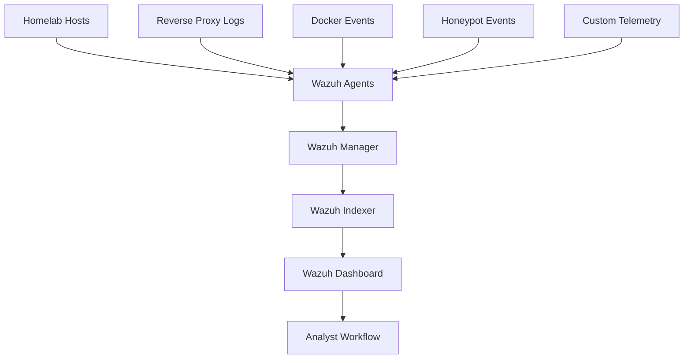

# Building A Homelab SIEM With Wazuh

This note captures the public version of a real Tempest Lab Systems milestone: turning a dedicated spare workstation into a working SOC/SIEM node and wiring the primary homelab host into it.

The goal was not just to install a dashboard. The goal was to make the lab observable: host events, container activity, reverse-proxy access, honeypot events, and earlier telemetry experiments all flowing into one defensive layer.

For the sanitized system design, see [Telemetry And SIEM Architecture](../architecture/telemetry-and-siem-architecture.md).

## What Was Built

The SIEM node runs Wazuh as a private-only security platform.

High-level shape:


```mermaid
flowchart TB
    endpoints["Homelab Hosts"] --> agents["Wazuh Agents"]
    agents --> manager["Wazuh Manager"]
    manager --> indexer["Wazuh Indexer"]
    indexer --> dashboard["Wazuh Dashboard"]
    reverseproxy["Reverse Proxy Logs"] --> agents
    docker["Docker Events"] --> agents
    honeypot["Honeypot Events"] --> agents
    telemetry["Custom Telemetry"] --> agents
    dashboard --> analyst["Analyst Workflow"]
```

Core pieces:

| Layer | Role |
| --- | --- |
| Dedicated SOC node | Runs the Wazuh manager, indexer, and dashboard |
| Primary lab host agent | Ships host, auth, service, Docker, proxy, and lab telemetry |
| Private DNS | Gives the SIEM a readable internal name |
| Monitoring | Watches dashboard/API/listener health separately |
| Password manager | Stores generated administrative credentials outside documentation |
| Runbooks | Capture install, validation, recovery, and gotchas |

The dedicated node was intentionally treated as its own platform tier. It is not a random dashboard added to the existing app host; it has its own storage expectations, private access path, monitoring checks, and recovery notes.

## How It Fits The Larger Platform

The SIEM is treated as a private platform service, not a public application.

| Platform Layer | SIEM Relationship |
| --- | --- |
| Identity and onboarding | Tracks who should have admin access and keeps future SSO/MFA integration on the roadmap. |
| Private DNS | Provides a clean internal access name without publishing the service. |
| Reverse proxy | Handles private HTTPS access where appropriate, but does not make the SIEM public. |
| Monitoring | Checks dashboard, API, and listener health separately from the SIEM's own alerts. |
| Notifications | Receives serious alerts after the signal is proven useful. |
| Runbooks | Store recovery checks, enrollment steps, and post-power-loss validation. |

## Why A Dedicated Node

Wazuh can be resource-hungry compared with small self-hosted apps. Moving it to a dedicated machine had a few practical wins:

- Keeps indexing and alerting load away from user-facing services.
- Makes storage growth easier to reason about.
- Gives the SOC layer its own maintenance window.
- Provides a cleaner migration path toward future DFIR tooling.
- Lets the original host remain focused on applications, media, and file services.

The dedicated box does not need to be exotic. A small-form-factor workstation with a modern enough CPU, 32GB RAM, and SSD storage is a solid starting point for a serious homelab SIEM.

## Private-Only Exposure

The SIEM dashboard and Wazuh ports were kept off the public internet.

The intended access model:

- Dashboard available only on LAN/VPN.
- Wazuh agent listener exposed only to trusted lab networks.
- Indexer API bound locally.
- Public domain and Cloudflare routes avoided for the SIEM.
- Monitoring checks remain internal.

This keeps the tool that watches the lab from becoming one more public admin surface to defend.

## First Agent Sources

The first enrolled host sends a useful starter set of telemetry:

| Source | Why It Matters |
| --- | --- |
| Auth logs | SSH, sudo, login, and privilege-use visibility |
| System logs | Service and host behavior |
| Reverse-proxy access logs | Web requests, status codes, user agents, and routing symptoms |
| Docker listener | Container lifecycle and runtime events |
| Honeypot logs | Intentional deception events from lab probes |
| Custom telemetry | Earlier lab-specific signals and staged detections |
| DNS/security filter logs | Query behavior, blocked domains, and internal lookup context |

The first success criterion was simple: the agent should appear active, log collectors should report the intended files, Docker events should show up, and test events should be searchable.

## Adding Workstation Telemetry

After the first server agent was stable, the next milestone was adding a Windows workstation. That changed the SIEM from "the lab host is observable" to "the lab can also see endpoint behavior."

The workstation stack used two layers:

| Layer | Value |
| --- | --- |
| Wazuh agent | Inventory, vulnerability detection, security configuration assessment, Windows event collection, and central agent status. |
| Sysmon | Process creation, suspicious file creation, selected registry activity, network connections, and persistence-oriented telemetry. |

The useful pattern was to treat workstation telemetry as a group policy inside Wazuh:

1. Install the endpoint agent with the private SIEM manager name.
2. Wait for the endpoint to appear active.
3. Assign it to a workstation group.
4. Let the group deploy event-channel collection for Sysmon and PowerShell.
5. Restart the endpoint agent so the shared config is picked up.
6. Validate with a short time window before trusting the dashboard.

The workstation group collected:

- `Microsoft-Windows-Sysmon/Operational`
- `Microsoft-Windows-PowerShell/Operational`
- `Windows PowerShell`

That gave the dashboard useful endpoint data without hand-editing every endpoint separately.

## The Sysmon Tuning Lesson

Sysmon immediately made the SIEM more useful, but it also created an excellent noise-tuning lesson.

The dashboard lit up with critical alerts for executable/script file creation under the user's temp directory. At first glance, that looks scary. The sample records told the real story: PowerShell was creating temporary files named like `__PSScriptPolicyTest_*.ps1` while checking execution policy.

That is a classic SIEM moment:

- The rule was not wrong.
- The event was not useless.
- The volume made it operationally unhelpful.

The first instinct was to tune the SIEM rule. That helped explain the problem, but the cleaner fix was source-side tuning in the Sysmon config. The endpoint should not ship thousands of known PowerShell self-test file events if they are not useful to the analyst.

The final pattern:

1. Confirm the top noisy rule.
2. Pull several raw event samples.
3. Identify the exact benign filename/path pattern.
4. Add a narrow Sysmon exclusion for that one pattern.
5. Re-apply the Sysmon config.
6. Check a short recent window, not the whole dashboard history.

Why the short window matters: historical alerts remain indexed. A dashboard looking at the last day can still show the old flood even after the fix is working.

The result was the right balance: temp-folder script and executable drops still matter, but PowerShell's own execution-policy probes no longer bury the analyst.

## Making Dashboards Useful

A dashboard that counts every event is not a SOC dashboard. It is a stress generator.

The Tempest Wazuh dashboards were split into analyst-oriented views:

| View | Purpose |
| --- | --- |
| SOC overview | Mission-control slice of actionable alerts, agents, severity, auth, public edge, and DNS signal. |
| Endpoint security | Workstation and server endpoint activity, vulnerability findings, hardening checks, Windows telemetry, and file integrity. |
| Network and public edge | Reverse-proxy probes, public route behavior, DNS blocks, and suspicious lookup patterns. |
| Host and containers | Docker lifecycle, service restarts, host auth, sudo, and container-focused operational signal. |

The important tuning decision was to keep baseline events available for investigation while excluding them from mission-level charts. Normal DNS observations and routine auth chatter can be searchable without dominating the main screen.

## Repeatable Endpoint Bootstrap

The next endpoint should not require rediscovering the process.

The documented endpoint bootstrap now follows this shape:

```powershell
.\install-tempest-windows-endpoint.ps1 -AgentName "workstation-name"
```

That wrapper performs the workstation flow:

1. Installs the Wazuh agent.
2. Points it at the private SIEM manager name.
3. Installs or updates Sysmon.
4. Applies the tuned Sysmon baseline.
5. Restarts the endpoint agent.
6. Prints the server-side group assignment command.

The server-side step is still explicit on purpose. Endpoint enrollment and group assignment are trust decisions, and those should stay visible instead of being hidden inside a convenience script.

## Making Reverse-Proxy Logs Useful

Raw reverse-proxy logs are valuable, but they become noisy quickly once a service is reachable from the internet.

The practical improvement was to classify common probe patterns into their own SIEM rules:

- Requests for sensitive files.
- Admin panel probes.
- Router, CGI, and exploit-path probes.
- Scanner user agents.
- Unusual HTTP methods.
- Upstream failures that indicate routing or origin issues.

This keeps public-edge telemetry useful without turning every web crawler into an incident.

## Adding DNS Context

DNS logs were added as a supporting signal rather than a standalone source of truth.

The useful fields were normalized into compact records:

- Query hostname.
- Query type.
- Client class.
- Upstream resolver.
- Cached status.
- Internal platform lookup vs external lookup.
- Blocked or allowed outcome.

That made it easier to connect "what tried to resolve" with "what later connected" without storing unnecessary bulky response data.

## A Real Gotcha: Dashboard API Credentials

One issue looked like “Wazuh is up, but the dashboard is not doing anything.”

The containers were healthy, the API port was reachable, and direct API authentication worked. The dashboard still showed the API connection offline.

The cause: generated credentials had been rotated into the real stack, but the dashboard-side Wazuh API configuration still had stale credentials.

The fix pattern:

1. Verify the Wazuh manager API works directly.
2. Verify internal container DNS can resolve the manager service.
3. Check dashboard logs for API auth failures.
4. Update the dashboard Wazuh API config from the current generated credential source.
5. Restart only the dashboard container.
6. Confirm dashboard API checks return successful responses.

That is a useful troubleshooting shape for any self-hosted dashboard that talks to a backend API: prove the backend, prove the network, then prove the service-to-service credential.

## Another Gotcha: Startup Order After Power Loss

The SOC node came back after outages, but there was a subtle timing issue: containers could start before the private network identity was fully available.

When a stack binds to specific private addresses, that can produce a half-working state:

- Containers are running.
- The dashboard process exists.
- The expected dashboard/API/listener ports are not bound correctly.
- Agents cannot reconnect.

The fix was not "restart everything." The better recovery pattern was:

1. Confirm the host has the expected network identities.
2. Check the actual listener bindings.
3. Restart only the Wazuh stack if bindings are missing or partial.
4. Verify dashboard, manager API, agent listener, and enrolled agents independently.

That lesson matters for any lab service that binds to VPN, VLAN, or interface-specific addresses.

## A Better Gotcha: SIEMs Remember Secrets

Enabling Docker telemetry immediately exposed a bad pattern in one container healthcheck.

The healthcheck put a Redis password directly into command arguments. Docker events recorded that command, and the SIEM faithfully indexed it.

That was a great reminder:

> If a secret appears in a command line, assume telemetry can capture it.

Safer pattern:

```yaml
healthcheck:
  test: ["CMD-SHELL", "REDISCLI_AUTH=\"$${REDIS_HOST_PASSWORD}\" redis-cli ping"]
```

Less safe pattern:

```yaml
healthcheck:
  test: ["CMD", "redis-cli", "-a", "${REDIS_HOST_PASSWORD}", "ping"]
```

The fix was to move the secret out of the visible command arguments, recreate only the affected container, confirm it returned healthy, and remove the old sensitive records from the alert index.

That lesson is bigger than Redis. It applies to healthchecks, `docker exec`, wrapper scripts, CI logs, service monitors, and any automation that might be observed by a log collector.

## Validation Checklist

Useful post-install checks:

- Wazuh containers are running.
- Dashboard redirects unauthenticated users to login.
- Indexer health is green.
- Manager API authentication succeeds.
- Agent summary shows the expected active host.
- Agent local logs show each intended file being analyzed.
- Docker listener reports it started.
- A harmless test event becomes searchable.
- Monitoring checks distinguish dashboard, API, and listener health.
- Public-edge test requests produce classified findings.
- DNS test lookups produce compact, searchable records.
- A reboot test proves the SOC node rejoins the private network and restores listener bindings.

## Operational Lessons

- A SIEM that only has its own dashboard logs is not useful yet.
- The first agent matters more than the first pretty chart.
- Separate “service is running” from “data is flowing.”
- Keep the SIEM private by default.
- Treat container command arguments as telemetry-visible.
- Tune public-edge logs into categories, not panic.
- Add DNS telemetry for context, not as a flood of raw payloads.
- Validate power-loss recovery while the fix is fresh.
- Write runbooks while the failure is fresh.
- Build small, prove each signal, then widen collection.

## What Comes Next

The next phase is to turn collected events into analyst workflow:

- Triage views for authentication events.
- Container restart and healthcheck dashboards.
- Honeypot/canary hit review.
- Reverse-proxy suspicious request views.
- Alert routing for high-severity events.
- A repeatable incident note template.
- Eventually, a second DFIR tool alongside Wazuh.

The important part is that the lab now has a real defensive spine: endpoint telemetry, container events, deception signals, and operational logs are flowing into a central place where they can be searched, investigated, and improved.
