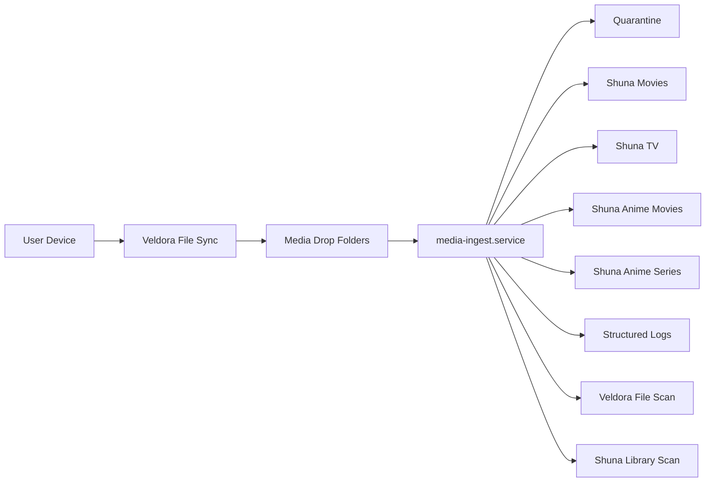
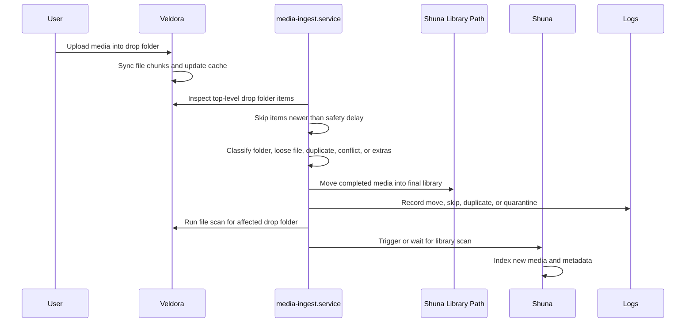

# Veldora To Shuna Media Ingest Workflow

This guide documents the sanitized Tempest pattern for moving media from Veldora, the file-sync service, into Shuna, the media server.

Reference tools:

- Veldora: Nextcloud-style file sync and browser upload surface.
- Shuna: Jellyfin-style media server.
- Media ingest job: host-local automation that moves settled uploads into final library paths.

The goal is to make media uploads easy for users without turning cloud storage into the permanent media library.

## Design Summary



## What This Solves

Direct uploads into a media library are brittle. A file-sync service is a better upload interface, but it creates a new problem: the upload area and the final media library should not be the same place.

This workflow handles:

- Incomplete uploads.
- Loose movie files.
- Full folders from disc rips.
- TV season folders.
- Anime movies and anime series.
- Duplicate uploads.
- Extras, featurettes, samples, and trailers.
- Ownership and permissions after files move across service boundaries.
- Veldora file-cache updates after automation moves files out of user storage.
- Shuna library refresh after imports land.
- Clear logs for moves, skips, duplicates, and quarantines.

## Sanitized Reference Layout

Use paths that match your environment. The important design is separation between upload staging, final libraries, and quarantine.

```text
/srv/tempest/
  media/
    Movies/
    TV/
    Music/
    Anime/
      Movies/
      Series/
  ingest/
    quarantine/
      Movies/
      TV/
      Anime-Movies/
      Anime-Series/
    logs/
```

Veldora user-facing drop folders:

```text
Files/
  Media-Movies/
  Media-TV/
  Media-Music/
  Media-Anime-Movies/
  Media-Anime-Series/
```

Example host-side mapping:

```text
/srv/veldora/data/<user>/files/Media-Movies        -> /srv/tempest/media/Movies
/srv/veldora/data/<user>/files/Media-TV            -> /srv/tempest/media/TV
/srv/veldora/data/<user>/files/Media-Anime-Movies  -> /srv/tempest/media/Anime/Movies
/srv/veldora/data/<user>/files/Media-Anime-Series  -> /srv/tempest/media/Anime/Series
```

Do not publish real usernames, internal domains, public IPs, or credential paths in public documentation.

## Workflow



## Drop Folder Contract

Each drop folder has one job.

| Drop Folder | Destination | Expected Content | Notes |
| --- | --- | --- | --- |
| `Media-Movies` | `Movies/` | Single movie folders or loose movie files | Loose files are wrapped into folders. |
| `Media-TV` | `TV/` | Show folders, season folders, or episode folders | Naming matters more here than movies. |
| `Media-Music` | `Music/` | Artist/album folders | Optional if music is part of the platform. |
| `Media-Anime-Movies` | `Anime/Movies/` | Anime movie files or folders | Keeps anime metadata separate from normal movies. |
| `Media-Anime-Series` | `Anime/Series/` | Anime series and seasons | Prevents series metadata from mixing with movie libraries. |

The ingest job should process top-level items only. It should not recursively pull random nested files out of a partially uploaded folder.

## Minimum Safety Rules

The ingest job should follow these rules before moving anything:

1. Acquire a lock so only one run is active.
2. Read the configured drop folders.
3. Ignore hidden files, partial files, sync temp files, and known upload markers.
4. Skip items newer than the minimum age.
5. Skip folders with files still changing size.
6. Detect duplicates before moving.
7. Quarantine conflicts instead of overwriting.
8. Normalize ownership and permissions after a successful move.
9. Rescan Veldora so the upload UI reflects the move.
10. Trigger or wait for Shuna library indexing.
11. Log every decision.

Recommended safety delay:

```text
MIN_AGE_SECONDS=600
```

Increase the delay for large remote uploads or slow upstream connections.

## Example Configuration

This is a sanitized example. Treat it as a pattern, not a copy-paste secret source.

```bash
# /etc/tempest/media-ingest.env

VELDORA_CONTAINER="veldora"
VELDORA_SCAN_USER="www-data"
VELDORA_FILES_ROOT="/srv/veldora/data/example-user/files"
VELDORA_OCC_PATH="/var/www/html/occ"

SHUNA_URL="http://127.0.0.1:8096"
SHUNA_API_KEY="replace-with-private-token"

MEDIA_ROOT="/srv/tempest/media"
QUARANTINE_ROOT="/srv/tempest/ingest/quarantine"
LOG_FILE="/srv/tempest/ingest/logs/media-ingest.log"

MEDIA_OWNER="media"
MEDIA_GROUP="media"
DROP_OWNER="www-data"
DROP_GROUP="www-data"

MIN_AGE_SECONDS=600
```

Keep the real file out of public repositories.

## Systemd Service And Timer

Use a service for manual runs and a timer for regular polling.

```ini
# /etc/systemd/system/media-ingest.service
[Unit]
Description=Move settled Veldora uploads into Shuna media libraries
Wants=docker.service
After=docker.service

[Service]
Type=oneshot
EnvironmentFile=/etc/tempest/media-ingest.env
ExecStart=/usr/local/sbin/media-ingest
```

```ini
# /etc/systemd/system/media-ingest.timer
[Unit]
Description=Run media ingest on a regular interval

[Timer]
OnBootSec=5min
OnUnitActiveSec=10min
Persistent=true

[Install]
WantedBy=timers.target
```

Enable the timer:

```bash
sudo systemctl daemon-reload
sudo systemctl enable --now media-ingest.timer
```

Manual run:

```bash
sudo systemctl start media-ingest.service
```

Check status:

```bash
systemctl status media-ingest.service --no-pager
systemctl list-timers media-ingest.timer
```

## Ingest Logic

The implementation can be Bash, Python, or PowerShell. The important part is the behavior.

```text
for each configured drop folder:
  for each top-level item:
    if item is hidden or temporary:
      log skip_temp
      continue

    if item age is less than MIN_AGE_SECONDS:
      log skip_too_new
      continue

    if item size is still changing:
      log skip_changing
      continue

    classify item:
      loose movie file
      movie folder
      tv folder
      anime movie
      anime series
      extras folder
      conflict

    if destination exists:
      if largest media file hash matches:
        remove duplicate source
        log duplicate_removed
      else:
        move source to quarantine
        log conflict_quarantined
      continue

    move item into destination
    set ownership and permissions
    log imported

scan affected Veldora paths
trigger Shuna library refresh
```

## Duplicate And Conflict Handling

Never blindly overwrite existing media.

Recommended behavior:

| Situation | Action |
| --- | --- |
| Destination does not exist | Move item into final library. |
| Destination exists and largest media file hash matches | Treat source as duplicate and remove or archive it. |
| Destination exists but hash differs | Quarantine source for manual review. |
| Item contains only extras or samples | Quarantine or skip based on library policy. |
| Folder is too new or changing | Skip until a later run. |

Example duplicate log:

```json
{"event":"duplicate_removed","kind":"movies","source":"Media-Movies/example","destination":"Movies/example","reason":"largest_media_hash_match"}
```

Example conflict log:

```json
{"event":"conflict_quarantined","kind":"movies","source":"Media-Movies/example","destination":"Movies/example","reason":"destination_exists_hash_mismatch"}
```

## Extras Handling

Movie rip folders often contain extras:

```text
Featurettes/
Extras/
Deleted Scenes/
Interviews/
Sample/
Samples/
Trailers/
```

Recommended first-pass behavior:

1. Keep the main movie folder.
2. Move extras folders into quarantine.
3. Import the main movie.
4. Review extras manually later.

This prevents Shuna from indexing featurettes, samples, or trailers as standalone movies.

## Veldora File Scan

When automation moves files out from under Veldora, Veldora still needs its file cache corrected.

Example scan:

```bash
docker exec --user www-data veldora php occ files:scan \
  --path="/example-user/files/Media-Movies" \
  --no-interaction
```

Scan each affected drop folder after a successful move or cleanup.

Useful commands:

```bash
docker exec --user www-data veldora php occ files:scan --all --no-interaction
docker exec --user www-data veldora php occ files:cleanup
docker exec --user www-data veldora php occ files:scan-app-data
```

Use targeted scans for normal ingest runs. Full scans are better for recovery windows.

## Shuna Library Refresh

Shuna can either detect changes on its own or receive a refresh request.

Example API refresh:

```bash
curl -X POST \
  -H "X-Emby-Token: ${SHUNA_API_KEY}" \
  "${SHUNA_URL}/Library/Refresh"
```

If the API key is not available to the ingest job, use Shuna scheduled scans and validate that new media appears after the next scan window.

## Permissions Model

Two services are involved, so ownership matters.

Recommended pattern:

| Path | Owner | Purpose |
| --- | --- | --- |
| Veldora drop folders | Veldora service user | Lets file sync read/write uploads. |
| Final Shuna libraries | Media service user/group | Lets Shuna read and index media. |
| Quarantine | Operator/media group | Allows manual review without exposing files to users. |
| Logs | Root or ingest service user | Prevents normal users from editing operational history. |

Example repair:

```bash
sudo chown -R media:media /srv/tempest/media
sudo find /srv/tempest/media -type d -exec chmod 775 {} \;
sudo find /srv/tempest/media -type f -exec chmod 664 {} \;
```

Repair Veldora drop folders separately:

```bash
sudo chown -R www-data:www-data /srv/veldora/data/example-user/files/Media-Movies
sudo chmod 775 /srv/veldora/data/example-user/files/Media-Movies
```

## Monitoring

Monitor the workflow, not just the containers.

| Check | Why It Matters |
| --- | --- |
| Veldora container responds | Users can upload. |
| Shuna container responds | Users can stream. |
| Drop folders exist | Upload paths are intact. |
| Ingest timer is active | Automation is running. |
| Last ingest log is recent | Timer is actually doing work. |
| Quarantine count is reasonable | Conflicts are not silently growing. |
| Media disk has free space | Imports will not fill the host. |
| Shuna library scan completes | Imported media becomes visible. |

Example checks:

```bash
systemctl is-active media-ingest.timer
systemctl list-timers media-ingest.timer
tail -50 /srv/tempest/ingest/logs/media-ingest.log
find /srv/tempest/ingest/quarantine -mindepth 1 -maxdepth 2 | wc -l
df -h /srv/tempest/media
curl -I http://127.0.0.1:8096
```

## Recovery: Drop Folder Missing Or Invisible

Failure mode:

The drop folder exists on disk but does not appear correctly in Veldora.

Likely causes:

- Folder recreated with the wrong owner.
- Veldora file cache is stale.
- Parent path permissions changed.
- Upload retry created a partial folder.

Recovery:

```bash
sudo mkdir -p "/srv/veldora/data/example-user/files/Media-Movies"
sudo chown www-data:www-data "/srv/veldora/data/example-user/files/Media-Movies"
sudo chmod 775 "/srv/veldora/data/example-user/files/Media-Movies"

docker exec --user www-data veldora php occ files:scan \
  --path="/example-user/files/Media-Movies" \
  --no-interaction
```

Verify:

```bash
docker exec --user www-data veldora php occ files:scan --path="/example-user/files" --no-interaction
ls -ld /srv/veldora/data/example-user/files/Media-Movies
```

## Recovery: Shuna Does Not Show Imported Media

Check in order:

1. Confirm the file moved into the expected library.
2. Confirm Shuna can read the file.
3. Confirm the library path is configured in Shuna.
4. Trigger a library scan.
5. Review Shuna logs for permission or metadata errors.

Commands:

```bash
find /srv/tempest/media/Movies -maxdepth 2 -type f | head
sudo -u media test -r "/srv/tempest/media/Movies/example/example.mkv"
curl -X POST -H "X-Emby-Token: ${SHUNA_API_KEY}" "${SHUNA_URL}/Library/Refresh"
docker logs shuna --tail 100
```

## Operator Runbook

Use this after a user says an upload is complete but the media is not visible.

1. Check whether the item is still in the Veldora drop folder.
2. Check whether the item is too new for the safety delay.
3. Check the last ingest log entries.
4. Check quarantine.
5. Check the final Shuna library path.
6. Trigger or wait for a Shuna scan.
7. Validate from a normal user account or client device.
8. Record the cause if the failure was new.

## Lessons Learned

- Veldora is a good upload interface, not the final media library.
- Shuna needs clean library boundaries to avoid metadata confusion.
- Automation should be cautious around partial uploads.
- File-cache scans are part of operating a file-sync-backed ingest workflow.
- Every move needs a log entry.
- Quarantine is better than overwrite.
- A manual run button is useful only when the same safety checks still apply.
