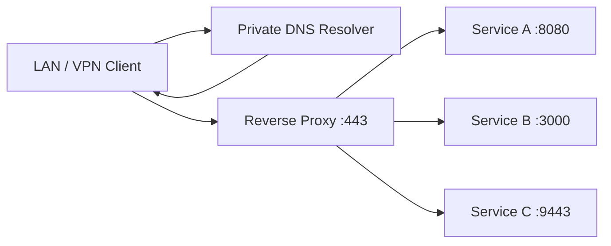

# Private DNS And Reverse Proxy Naming Layer

One of the first upgrades that made the lab feel like a real platform was replacing raw IP-and-port access with clean service names.

Instead of:

```text
http://10.10.0.10:8096
https://10.10.0.10:9443
```

the lab uses private names:

```text
https://media.lab.example.internal
https://containers.lab.example.internal
```

This guide explains the reference pattern.

## Goals

- Give every service a memorable name.
- Keep admin services private.
- Use HTTPS internally.
- Make LAN and VPN clients behave consistently.
- Keep public DNS separate from private DNS.
- Route through one reverse proxy instead of exposing every service directly.

## Reference Design



## DNS Layer

The private DNS resolver owns an internal-only domain:

```text
lab.example.internal
```

Each service gets a rewrite:

| Private Name | Target |
| --- | --- |
| `media.lab.example.internal` | `10.10.0.10` |
| `files.lab.example.internal` | `10.10.0.10` |
| `monitoring.lab.example.internal` | `10.10.0.10` |
| `containers.lab.example.internal` | `10.10.0.10` |

The DNS resolver returns the lab host address. The reverse proxy then decides which backend port gets the request.

## Reverse Proxy Layer

Example Caddy-style pattern:

```caddy
(access_log) {
    log {
        output file /logs/access.log
        format json
    }
}

https://media.lab.example.internal {
    import access_log
    tls internal
    reverse_proxy 10.10.0.10:8096
}

http://media.lab.example.internal {
    import access_log
    redir https://media.lab.example.internal{uri}
}
```

## Important Container Networking Lesson

If the reverse proxy runs inside Docker, this is usually wrong:

```caddy
reverse_proxy 127.0.0.1:8096
```

Inside a container, `127.0.0.1` means the reverse proxy container itself, not the host.

Use one of these instead:

- The backend container name on a shared Docker network.
- The host LAN address.
- A deliberate host-gateway pattern.

## VPN And Offsite Access

Private DNS alone is not enough. Offsite clients also need a route to the returned address.

If private DNS returns:

```text
media.lab.example.internal -> 10.10.0.10
```

then the VPN client needs a route to `10.10.0.0/24`.

Troubleshooting split:

| Symptom | Likely Problem |
| --- | --- |
| Name does not resolve | Client is not using private DNS |
| Name resolves but times out | Client has no route to the returned private IP |
| HTTPS certificate warning | Client does not trust the internal CA |
| 502 from proxy | Proxy cannot reach backend |

## Public DNS Is Separate

Public records should not be mixed blindly with private rewrites.

Recommended model:

- Internal admin services: private DNS only.
- User-facing services: public DNS only after exposure review.
- Same hostname on LAN and Internet: use split-horizon carefully and document both paths.

## Validation Commands

From a client:

```bash
nslookup media.lab.example.internal
curl -k -I https://media.lab.example.internal
```

From the host:

```bash
docker ps
curl -I http://10.10.0.10:8096
docker logs reverse-proxy --tail 100
```

## Lessons Learned

- Clean names make the lab easier to operate.
- DNS success and network reachability are separate checks.
- Reverse proxy containers need deliberate upstream addressing.
- Internal HTTPS is worth the certificate-trust work.
- Public and private access paths need separate threat models.
