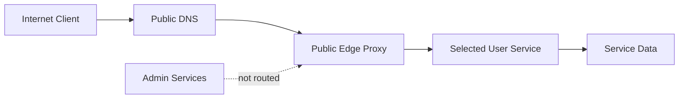

# Public And Private Service Edge

Not every self-hosted service should be public.

This guide describes a model for deciding which services can leave the private network and which should stay behind LAN/VPN access.

## Service Exposure Tiers

| Tier | Example Service Type | Public? |
| --- | --- | --- |
| Tier 0 | Password vault, container admin, DNS admin | No |
| Tier 1 | Monitoring admin, identity admin, security dashboards | No |
| Tier 2 | File sync, media streaming | Maybe, after hardening |
| Tier 3 | Portfolio, demo apps, public docs | Yes |

## Decision Checklist

Before exposing a service publicly:

- Does it have its own strong authentication?
- Does it support MFA or compensating controls?
- Can users be least-privilege?
- Is there rate limiting or ban logic?
- Is the public edge isolated from private admin routes?
- Is there an internal origin monitor and a public-path monitor?
- Is rollback documented?
- Does the service expose private metadata in headers, errors, or unauthenticated pages?

## Public Edge Pattern



The public edge should know only the service it is meant to publish.

Avoid routing an entire private reverse proxy to the Internet. That makes accidental exposure much easier.

## Monitoring Pattern

Use two monitors for public services:

| Monitor | Purpose |
| --- | --- |
| Internal origin | Confirms the service works from inside the lab |
| Public path | Confirms DNS, NAT/tunnel, TLS, proxy, and app all work from outside |

If the origin is healthy but public path fails, troubleshoot DNS, NAT, tunnel, certificate, or public proxy first.

If both fail, troubleshoot the service itself.

## Rollback Pattern

Every public exposure should have a rollback plan:

```text
1. Remove or disable public DNS/tunnel route.
2. Stop public edge container or remove NAT mapping.
3. Confirm external URL no longer responds.
4. Confirm private URL still works.
5. Review logs for attempted access during exposure window.
```

## Hardening Headers

For web apps, consider:

```text
Strict-Transport-Security
Content-Security-Policy
X-Frame-Options or frame-ancestors
X-Content-Type-Options
Referrer-Policy
Permissions-Policy
```

Some apps need careful testing before strict CSP is applied.

## Lessons Learned

- "Can I expose this?" and "Should I expose this?" are different questions.
- Public user services need a different risk model than admin tools.
- Separate public-edge routing reduces blast radius.
- Monitoring should distinguish origin failures from public-path failures.
