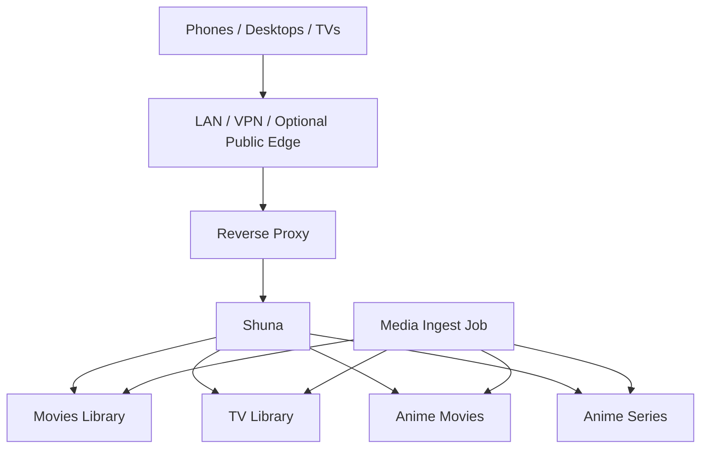

# Shuna Jellyfin Operations

Shuna is the Tempest media server pattern. In this repository it represents a sanitized Jellyfin-style service used for private streaming, client testing, library organization, and media operations.

## Role In The Platform



Shuna provides:

- Media streaming.
- User access separation.
- Library metadata management.
- Client validation across phones, desktops, tablets, and TV apps.
- A real operational test case for DNS, proxy, routing, storage, and monitoring.

## Library Layout

Use separate libraries where metadata behavior differs.

```text
/srv/tempest/media/
  Movies/
  TV/
  Music/
  Anime/
    Movies/
    Series/
```

Recommended Shuna libraries:

| Library | Path | Reason |
| --- | --- | --- |
| Movies | `/srv/tempest/media/Movies` | Normal movie metadata. |
| TV | `/srv/tempest/media/TV` | Show and season metadata. |
| Anime Movies | `/srv/tempest/media/Anime/Movies` | Avoids mixing anime movies with regular movies. |
| Anime Series | `/srv/tempest/media/Anime/Series` | Keeps anime series metadata separate. |
| Music | `/srv/tempest/media/Music` | Optional if Shuna handles music. |

## Sanitized Docker Compose Pattern

```yaml
services:
  shuna:
    image: jellyfin/jellyfin:stable
    restart: unless-stopped
    environment:
      TZ: America/Chicago
    volumes:
      - /srv/shuna/config:/config
      - /srv/shuna/cache:/cache
      - /srv/tempest/media:/media:ro
    networks:
      - proxy
    devices:
      # Optional hardware acceleration example.
      # - /dev/dri:/dev/dri

networks:
  proxy:
    external: true
```

Mount media read-only unless Shuna needs write access for a specific, understood reason.

## Reverse Proxy Pattern

```caddy
https://media.lab.example.internal {
    tls internal
    reverse_proxy shuna:8096
}
```

For optional public access, review:

- User account strength.
- Admin account separation.
- Remote access settings.
- Public-path monitoring.
- Rate limiting or upstream protection.
- Rollback plan.

## User Model

Recommended pattern:

- Separate admin and normal user accounts.
- Give normal users only the libraries they need.
- Test from a normal user account after changes.
- Disable or remove accounts when no longer needed.
- Avoid sharing admin credentials with client devices.

## Metadata Operations

Common issues:

- Extras appear as movies.
- TV episodes split into multiple shows.
- Anime metadata does not match normal movie assumptions.
- Bad rips index successfully but fail during playback.
- Library scans lag behind imports.

Operational response:

1. Confirm the files are in the expected library path.
2. Confirm naming and folder shape.
3. Confirm Shuna can read the files.
4. Refresh metadata or library scan.
5. Correct library separation if metadata keeps landing wrong.
6. Remove and re-import bad rips instead of hiding the issue.

## Library Refresh

API refresh example:

```bash
curl -X POST \
  -H "X-Emby-Token: ${SHUNA_API_KEY}" \
  "http://127.0.0.1:8096/Library/Refresh"
```

Container check:

```bash
docker ps --filter name=shuna
docker logs shuna --tail 100
curl -I http://127.0.0.1:8096
```

File permission check:

```bash
sudo -u media test -r "/srv/tempest/media/Movies/example/example.mkv"
find /srv/tempest/media -maxdepth 2 -type d -ls
```

## Monitoring

A useful Shuna monitor checks more than whether the container exists.

| Monitor | Purpose |
| --- | --- |
| Container running | Confirms the process exists. |
| Local origin HTTP | Confirms Shuna responds on the host/container network. |
| Private DNS route | Confirms internal name and proxy path work. |
| Optional public URL | Confirms external route, TLS, proxy, and app path. |
| Disk usage | Prevents ingest and metadata failures. |
| Recent ingest activity | Confirms new media is flowing. |
| Playback test | Confirms user experience, not just service health. |

## Client Validation

Test like a real user:

1. Phone on LAN.
2. Phone off Wi-Fi.
3. Desktop browser.
4. TV app.
5. Normal non-admin user.
6. VPN-connected device.
7. Optional public route, if enabled.

This catches failures that a green container status will miss.

## Recovery Checklist

Use this when users cannot play media.

1. Confirm Shuna is running.
2. Confirm the origin responds.
3. Confirm DNS resolves to the expected route.
4. Confirm the reverse proxy reaches Shuna.
5. Confirm the user account has access to the library.
6. Confirm the media file exists.
7. Confirm Shuna can read the file.
8. Check storage pressure.
9. Check logs.
10. Test from a known-good client.

## Lessons Learned

- Streaming is a chain: client, DNS, route, proxy, app, storage, file, and metadata.
- A media server becomes an operations project when other users depend on it.
- Library separation prevents avoidable metadata problems.
- Read-only media mounts reduce accidental changes.
- Client testing matters because TVs, phones, desktops, VPN clients, and browsers fail differently.
