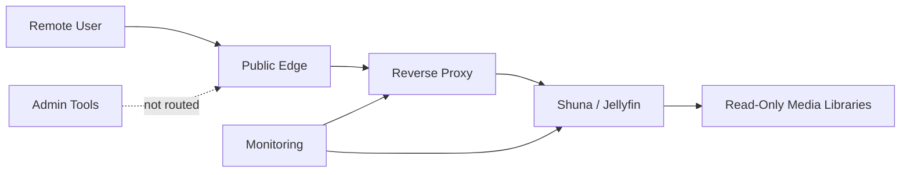
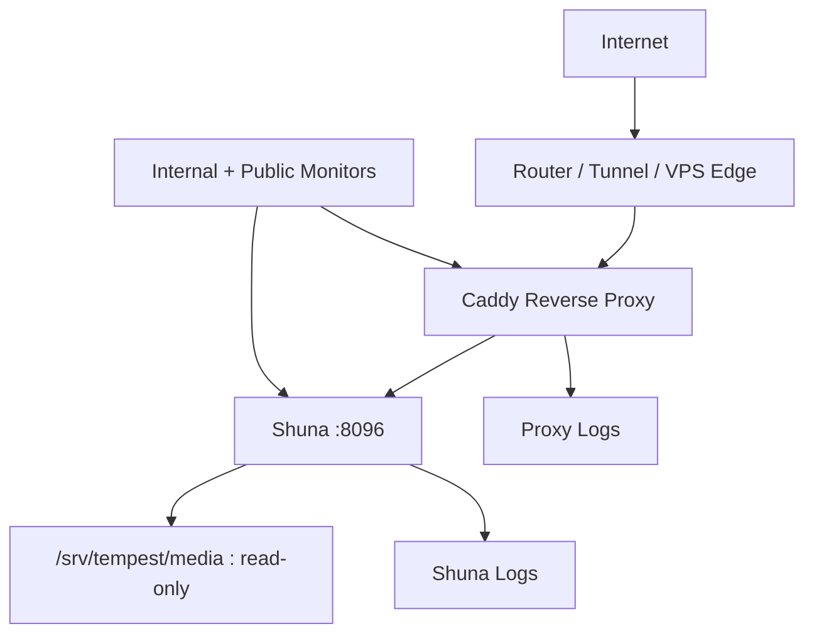

# Shuna Public Edge And Reverse Proxy

This guide documents the sanitized Tempest pattern for making a Shuna/Jellyfin-style media server reachable outside the LAN without exposing the whole platform.

It covers two stages:

1. Working without your own domain.
2. Moving to the cleaner model with your own domain.

The goal is to share the engineering pattern without publishing real hostnames, public IPs, credentials, user names, or network details.

## Design Goal

Shuna should be reachable by approved users while administrative surfaces stay private.



The public edge should publish only the media user surface. It should not publish container admin, DNS admin, monitoring admin, file-sync admin, SSH, databases, or the private reverse proxy dashboard.

## Common Problems This Solves

Jellyfin-style public access often fails in predictable ways:

- The service works on LAN but fails offsite.
- DNS resolves but the client has no route.
- The reverse proxy works in a browser but the phone or TV app fails.
- WebSockets or long-lived connections break through the proxy.
- HTTPS terminates at the proxy but Shuna generates wrong internal URLs.
- Public and private paths behave differently.
- Port forwarding accidentally exposes the app directly instead of the proxy.
- Admin accounts are used on client devices.
- The public route works, but monitoring cannot tell whether the origin or the edge failed.

Tempest treats public media access as an edge design problem, not just "open a port."

## Recommended Architecture



Recommended properties:

- HTTPS terminates at the reverse proxy.
- Shuna listens only on the private host/container network.
- The public edge routes only to Shuna.
- Media libraries are mounted read-only into Shuna.
- Admin tools stay LAN/VPN/private only.
- Public and internal monitors are separate.

## Option A: No Owned Domain Yet

This is useful while proving the access path before buying or configuring a domain.

### Safer No-Domain Options

| Method | Public? | Notes |
| --- | --- | --- |
| VPN or tailnet access | No | Best early option. Users connect privately, then use the internal Shuna URL. |
| Dynamic DNS provider hostname | Yes | You do not own a domain, but you still get a stable hostname. Treat it like public exposure. |
| Public IP plus port | Yes | Works for testing but is less friendly, harder to secure cleanly, and more brittle. |
| Tunnel provider hostname | Yes | Can avoid router port forwarding, but still creates a public edge that needs controls. |

The safest no-domain pattern is private remote access through VPN/tailnet. The most realistic public no-domain pattern is a dynamic DNS hostname.

### No-Domain Private Access Pattern

```text
Remote device -> VPN/tailnet -> private DNS or private IP -> reverse proxy -> Shuna
```

Example access paths:

```text
https://media.lab.example.internal
http://10.10.0.10:8096
```

Use this when:

- Only trusted users need access.
- You do not need public app-store-style simplicity.
- You want to avoid exposing Shuna to the internet.

Validation:

```bash
nslookup media.lab.example.internal
curl -k -I https://media.lab.example.internal
curl -I http://10.10.0.10:8096
```

### No-Domain Public Access Pattern

```text
Remote device -> dynamic DNS hostname -> router/tunnel -> reverse proxy -> Shuna
```

Example sanitized hostname:

```text
https://example-media.dynamic-dns.example
```

If using dynamic DNS:

1. Create the dynamic DNS record.
2. Confirm it resolves to the current public endpoint.
3. Forward only ports `80` and `443` to the reverse proxy, not to Shuna directly.
4. Let the reverse proxy route traffic to Shuna internally.
5. Monitor both the internal origin and the public route.

Do not forward public traffic directly to Shuna's internal HTTP port unless you intentionally accept that risk. The cleaner model is public HTTPS to the proxy, then private HTTP to Shuna.

## Option B: Owned Domain

This is the cleaner long-term model.

```text
media.example.com -> public DNS -> router/tunnel -> reverse proxy -> Shuna
```

Benefits:

- Stable user-facing URL.
- Cleaner TLS certificate automation.
- Easier app setup for users.
- Cleaner monitoring.
- Easier migration later if the public edge moves.

Recommended public DNS:

```text
media.example.com A     <public-ip>
media.example.com AAAA  <public-ipv6-if-used>
```

Or point the record at a tunnel/provider target if your edge uses a tunnel.

## Caddy Reverse Proxy Pattern

The Jellyfin project recommends Caddy as an easy reverse proxy option, especially for HTTPS. This sanitized pattern uses a dedicated subdomain.

```caddy
media.example.com {
    encode zstd gzip
    reverse_proxy shuna:8096
}
```

If Caddy runs on the host and Shuna listens on the host:

```caddy
media.example.com {
    encode zstd gzip
    reverse_proxy 127.0.0.1:8096
}
```

If Caddy runs in Docker and Shuna is another container on the same Docker network:

```caddy
media.example.com {
    encode zstd gzip
    reverse_proxy shuna:8096
}
```

If Caddy runs in Docker but Shuna runs on the host:

```caddy
media.example.com {
    encode zstd gzip
    reverse_proxy host.docker.internal:8096
}
```

On Linux, `host.docker.internal` may require an explicit host-gateway mapping.

## Subdomain Versus Subpath

Preferred:

```text
https://media.example.com
```

More complex:

```text
https://example.com/jellyfin
```

Subdomains are simpler for users and usually easier to troubleshoot.

If using a subpath, Jellyfin needs a matching Base URL such as:

```text
/jellyfin
```

Set it in the Jellyfin admin networking settings or the server configuration. Restart Jellyfin after changing it.

## Shuna Network Settings

Use Shuna/Jellyfin network settings intentionally:

| Setting Area | Public Edge Guidance |
| --- | --- |
| Remote access | Enable only if this service is intended to be reached remotely. |
| Published server URL | Set to the public URL when clients need a stable external address. |
| Base URL | Leave blank for subdomain; set only for subpath deployments. |
| Known proxies | Configure if your deployment requires proxy awareness. |
| HTTPS inside app | Usually let the reverse proxy handle HTTPS. |

The exact UI labels can vary by version, so document what was changed in your own runbook.

## Router And Firewall Rules

Recommended public forwarding:

| External Port | Internal Target |
| --- | --- |
| 80/tcp | Reverse proxy only |
| 443/tcp | Reverse proxy only |

Avoid:

```text
public internet -> 8096/tcp -> Shuna
```

Better:

```text
public internet -> 443/tcp -> reverse proxy -> Shuna:8096
```

Firewall posture:

- Shuna origin port reachable only from the reverse proxy or private network.
- Admin tools reachable only from LAN/VPN.
- SSH restricted to trusted admin paths.
- Database and file paths not exposed.

## Account Hardening

Before exposing Shuna publicly:

1. Create separate admin and user accounts.
2. Do not sign into TVs or shared devices with admin accounts.
3. Disable or delete unused users.
4. Use strong passwords.
5. Limit libraries per user.
6. Disable features users do not need.
7. Review remote access settings.
8. Review logs after enabling public access.

If MFA or stronger upstream authentication is available in your design, document where it lives and how users recover access.

## Reverse Proxy Headers

A reverse proxy should preserve the client and scheme information Shuna needs.

Caddy usually handles the common proxy headers automatically. With Nginx or other proxies, verify headers such as:

```nginx
proxy_set_header Host $host;
proxy_set_header X-Real-IP $remote_addr;
proxy_set_header X-Forwarded-For $proxy_add_x_forwarded_for;
proxy_set_header X-Forwarded-Proto $scheme;
proxy_set_header X-Forwarded-Host $host;
```

If clients behave strangely, compare:

- Browser access.
- Mobile app access.
- TV app access.
- Public URL.
- Private URL.

## Validation Checklist

Run these checks before telling users the public path is ready.

### Internal Origin

```bash
curl -I http://127.0.0.1:8096
docker logs shuna --tail 100
```

### Private Proxy

```bash
curl -k -I https://media.lab.example.internal
```

### Public DNS

```bash
nslookup media.example.com
```

### Public HTTPS

```bash
curl -I https://media.example.com
```

### Public Client Test

Test from:

- Phone off Wi-Fi.
- Desktop browser outside the LAN.
- Jellyfin mobile app.
- TV app if used.
- Non-admin user account.

## Monitoring Pattern

Use separate monitors so failures are easy to locate.

| Monitor | Target | What It Proves |
| --- | --- | --- |
| Origin | `http://127.0.0.1:8096` | Shuna is alive locally. |
| Private proxy | `https://media.lab.example.internal` | Internal DNS/proxy path works. |
| Public route | `https://media.example.com` | Public DNS/TLS/edge/proxy path works. |
| Playback/user workflow | App or browser login test | User experience works. |
| Disk | `/srv/tempest/media` | Storage is not near failure. |

Triage:

| Origin | Public | Likely Area |
| --- | --- | --- |
| Up | Down | DNS, router, tunnel, TLS, proxy, firewall. |
| Down | Down | Shuna, host, storage, container, permissions. |
| Down | Up | Monitor bug, cache, or unexpected proxy behavior. |

## Common Failure Modes

| Symptom | Likely Cause | Fix |
| --- | --- | --- |
| Works on LAN, fails offsite | Public DNS, port forward, tunnel, or firewall issue | Check DNS, edge route, and proxy logs. |
| Browser works, app fails | Public URL, Base URL, proxy headers, or TLS issue | Test subdomain model and app server URL. |
| HTTPS certificate fails | DNS not pointing correctly or port 80/443 blocked | Fix DNS and ACME reachability. |
| Proxy returns 502 | Proxy cannot reach Shuna origin | Check Docker network, host address, and container state. |
| Login works but playback fails | Bandwidth, transcoding, permissions, or client issue | Check Shuna logs and media file permissions. |
| TV app cannot connect | URL, TLS, app compatibility, or account permissions | Test with a normal user and public URL. |
| Remote user sees admin areas | Account/library permissions too broad | Tighten user policy and stop using admin accounts on clients. |

## Rollback Plan

Every public exposure should have a rollback.

```text
1. Disable public DNS, tunnel, or port forward.
2. Reload the reverse proxy.
3. Confirm the public URL no longer responds.
4. Confirm private Shuna access still works.
5. Review proxy and Shuna logs.
6. Document the trigger and fix before re-enabling.
```

Commands:

```bash
sudo systemctl reload caddy
curl -I https://media.example.com
curl -k -I https://media.lab.example.internal
docker logs shuna --tail 100
```

## Public-Safe Documentation Rules

When documenting your own setup publicly:

- Use fake domains like `media.example.com`.
- Use private example networks like `10.10.0.0/24`.
- Do not publish public IPs.
- Do not publish usernames.
- Do not publish API keys.
- Do not publish screenshots with media libraries, users, tokens, or public edge provider details.
- Explain the architecture and operating pattern instead of copying secrets.

## Lessons Learned

- Public media access is an edge architecture problem, not only a Jellyfin setting.
- The no-domain path is good for proving the workflow, but an owned domain is cleaner.
- Subdomains are simpler than subpaths.
- The reverse proxy should be public; Shuna's origin port should stay private.
- Public and private monitors need to be separate.
- Client testing matters because browsers, phones, and TV apps fail differently.
- Rollback should exist before the first public exposure.
