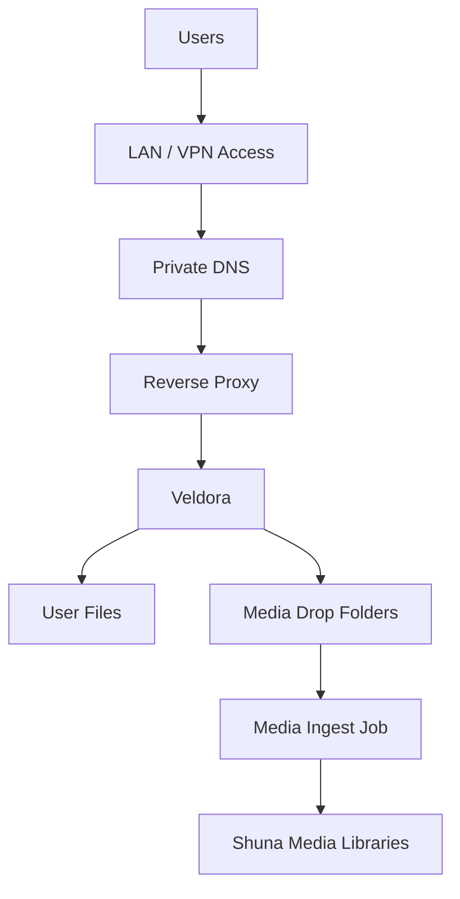

# Veldora Nextcloud Operations

Veldora is the Tempest file-sync service pattern. In this repository it represents a sanitized Nextcloud-style service used for private file access and controlled media upload staging.

This guide focuses on operating Veldora as infrastructure, not on exposing private user data.

## Role In The Platform



Veldora provides:

- Browser upload surface.
- Desktop and mobile sync access.
- Temporary media drop folders.
- Private file access.
- A user-friendly front end for workflows that automation completes later.

## Access Model

Recommended default:

| Surface | Access |
| --- | --- |
| User file UI | LAN/VPN or carefully reviewed user edge. |
| Admin settings | Private only. |
| Database | Not public. |
| Data directory | Host-local only. |
| Drop folders | Limited users or groups. |

Do not make Veldora public just because it has a login page. Treat public exposure as a separate security review.

## Sanitized Docker Compose Pattern

This is a reference pattern. Replace image versions, paths, networks, and environment variables for your environment.

```yaml
services:
  veldora-db:
    image: mariadb:11
    restart: unless-stopped
    command: --transaction-isolation=READ-COMMITTED --binlog-format=ROW
    environment:
      MYSQL_DATABASE: nextcloud
      MYSQL_USER: nextcloud
      MYSQL_PASSWORD: ${VELDORA_DB_PASSWORD}
      MYSQL_ROOT_PASSWORD: ${VELDORA_DB_ROOT_PASSWORD}
    volumes:
      - /srv/veldora/db:/var/lib/mysql
    networks:
      - veldora

  veldora:
    image: nextcloud:stable
    restart: unless-stopped
    depends_on:
      - veldora-db
    environment:
      MYSQL_HOST: veldora-db
      MYSQL_DATABASE: nextcloud
      MYSQL_USER: nextcloud
      MYSQL_PASSWORD: ${VELDORA_DB_PASSWORD}
      NEXTCLOUD_TRUSTED_DOMAINS: files.lab.example.internal
      TRUSTED_PROXIES: 172.20.0.0/16
      OVERWRITEPROTOCOL: https
    volumes:
      - /srv/veldora/html:/var/www/html
      - /srv/veldora/data:/var/www/html/data
    networks:
      - veldora
      - proxy

networks:
  veldora:
  proxy:
    external: true
```

Keep real `.env` files out of public repositories.

## Reverse Proxy Pattern

```caddy
https://files.lab.example.internal {
    tls internal
    reverse_proxy veldora:80
}
```

If exposed outside the private network, add a full public-edge review first:

- Authentication and MFA.
- Rate limiting or ban controls.
- Upload limits.
- Public-path monitoring.
- Header review.
- Rollback plan.

## Drop Folder Setup

Create dedicated upload folders for media staging:

```text
Media-Movies
Media-TV
Media-Music
Media-Anime-Movies
Media-Anime-Series
```

Recommended practice:

- Assign drop folders to a specific user or group.
- Do not let drop folders become permanent storage.
- Keep folder naming boring and predictable.
- Let ingest automation move completed uploads.
- Use Veldora scans after host-side moves.

## Operating Commands

Run `occ` through the container as the web service user:

```bash
docker exec --user www-data veldora php occ status
docker exec --user www-data veldora php occ files:scan --path="/example-user/files/Media-Movies" --no-interaction
docker exec --user www-data veldora php occ files:cleanup
docker exec --user www-data veldora php occ maintenance:mode --on
docker exec --user www-data veldora php occ maintenance:mode --off
```

Check logs:

```bash
docker logs veldora --tail 100
tail -100 /srv/veldora/data/nextcloud.log
```

Check data path ownership:

```bash
ls -ld /srv/veldora/data
find /srv/veldora/data/example-user/files -maxdepth 2 -type d -name "Media-*"
```

## Maintenance Checklist

Use this after container updates, host restarts, storage changes, or upload issues.

1. Confirm the container is running.
2. Confirm the database is running.
3. Confirm private DNS resolves.
4. Confirm reverse proxy reaches Veldora.
5. Confirm user login works.
6. Confirm drop folders are visible.
7. Confirm ownership on drop folders.
8. Run targeted file scans if automation moved files.
9. Confirm the ingest job can read the drop folders.
10. Check available storage.

## Troubleshooting

| Symptom | Likely Area | Check |
| --- | --- | --- |
| Login page does not load | Proxy, DNS, container | `curl -k -I https://files.lab.example.internal` |
| Upload starts then fails | Storage, PHP limits, proxy limits | Container logs and reverse proxy logs |
| Folder exists on disk but not in UI | File cache or ownership | `occ files:scan --path=...` |
| Ingest cannot move files | Permissions | Drop folder owner and media destination owner |
| Users see stale files | Cache scan needed | Targeted `occ files:scan` |

## Security Notes

- Keep admin access private.
- Use strong passwords and MFA where available.
- Do not publish real usernames or folder paths tied to private data.
- Keep database and data directories off the public edge.
- Review public exposure separately from LAN/VPN access.
- Back up configuration and data before major updates.

## Lessons Learned

- File sync is excellent for user upload ergonomics.
- Host-side automation must respect Veldora's file cache.
- Ownership mistakes can look like application bugs.
- Drop folders need explicit operating rules.
- Storage pressure is an application problem and an infrastructure problem at the same time.
