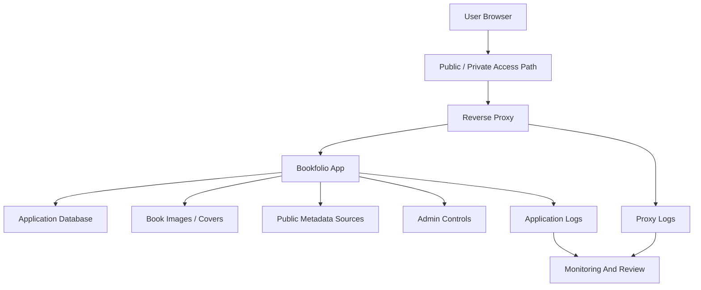

# Bookfolio Case Study

Bookfolio is a product-style application for cataloging physical books.

The public version of this case study focuses on product thinking, operations, and platform integration. It does not publish private source code, database internals, credentials, deployment secrets, user data, or unreleased implementation details.

## The Product Problem

Physical book collections are surprisingly hard to manage once they grow past a few shelves.

The real workflow is messy:

- Some books scan cleanly by barcode or ISBN.
- Some books have no barcode.
- Some books have old, damaged, or unusual identifiers.
- Metadata from public sources can be incomplete or wrong.
- Cover art may be missing.
- A user may need personal notes, value tracking, sold history, or printable records.
- A household or small team may need separate user accounts without mixing collections.

Bookfolio is built around that reality instead of assuming every book has perfect metadata.

## Current Capability Shape

| Area | Capability |
| --- | --- |
| Intake | Add books through scan, ISBN, title, author, or manual entry. |
| Metadata | Review and correct title, author, identifiers, notes, and cover data. |
| Images | Upload images and choose one as the listing cover when metadata lookup fails. |
| Library management | Search, filter, select multiple items, and perform bulk actions. |
| User management | Admin area for adding, disabling, and removing users. |
| Ownership | Keep user libraries separated instead of treating the app like one shared pile. |
| Public access | Runs as a selected public-facing service behind a hardened reverse proxy. |
| Operations | Monitored, documented, and included in the platform service catalog. |

## Architecture Pattern

Bookfolio is treated as a real platform service, not a throwaway app.

Key architecture ideas:

- Public access is limited to the app, not the entire lab.
- Admin features are separate from normal user workflow.
- User data boundaries matter even in a homelab.
- Metadata lookup failures are expected, not treated as rare bugs.
- Uploaded images and generated records are first-class product data.
- Monitoring covers both the app and the edge path.

## Product Lessons

### ISBN Cannot Be Required

The first version leaned too hard on ISBN/barcode lookup. Real collections broke that assumption quickly.

The better model is flexible intake:

- Search by ISBN when available.
- Search by title.
- Search by author.
- Combine title and author when that improves confidence.
- Allow manual entries when public metadata is weak.

That small product change matters because it turns "this book cannot be added" into "this book needs a different intake path."

### Cover Art Needs User Control

Metadata sources do not always return good cover art.

The improved workflow lets users upload images and choose the one that should represent the listing. This is a product-quality detail: the system should help the user build a clean catalog even when automation cannot find the perfect answer.

### Admin UX Becomes Necessary Fast

Once real users enter the system, manual database edits stop being acceptable.

The admin area needs to handle:

- Create user.
- Activate or deactivate user.
- Delete user and their data when appropriate.
- Review user state without exposing private data unnecessarily.
- Keep future quota, role, and support workflows possible.

That is the difference between a personal script and an application that can support other people.

### Bulk Actions Are Not Optional

Catalog apps need bulk operations because cleanup happens in batches.

Useful examples:

- Delete selected entries.
- Update selected status.
- Mark items sold.
- Export selected records.
- Prepare printable reports.

Bulk actions reduce friction and make the app feel like a tool instead of a form with a database behind it.

## Operations And Security

Bookfolio is public-facing, so it follows a stricter service model than private-only lab tools.

| Concern | Pattern |
| --- | --- |
| Public route | Reverse proxy terminates HTTPS and routes only to the app. |
| Admin access | Admin functionality is role-restricted inside the app. |
| Credentials | Stored in the private password manager, not documentation. |
| Monitoring | Public route and internal origin are checked separately. |
| Logs | App and proxy logs are reviewed for troubleshooting and suspicious behavior. |
| User data | Collections are separated by user. |
| Recovery | Operational notes cover app restart, failed save behavior, and user cleanup. |

## What Makes It Portfolio-Worthy

Bookfolio is useful because it combines product and infrastructure work:

- Real user workflow design.
- Barcode and metadata edge cases.
- Manual correction paths.
- Image handling.
- Admin/user management.
- Public service hardening.
- Monitoring and recovery.
- Product polish without losing operational discipline.

It is the kind of project that looks simple until real users and messy data show up. That is exactly why it is valuable engineering evidence.

## Future Direction

The next product-level improvements are:

- Sold/history records for financial and personal tracking.
- Printable statements and exports.
- Better quota/storage visibility per user.
- More complete admin controls.
- Optional account recovery flow through an external identity provider.
- Stronger reporting for collection value, missing metadata, and cleanup tasks.

The long-term goal is to keep the app useful as a real product while continuing to run it inside the same monitored, documented platform model as the rest of Tempest.
